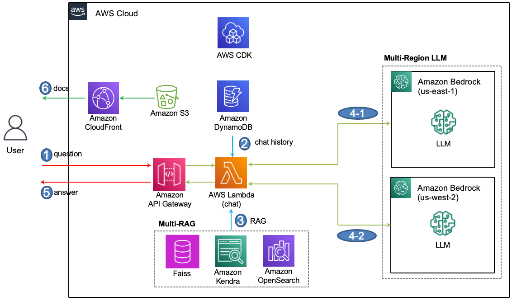
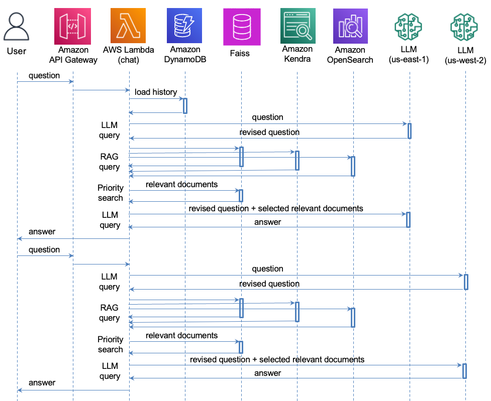
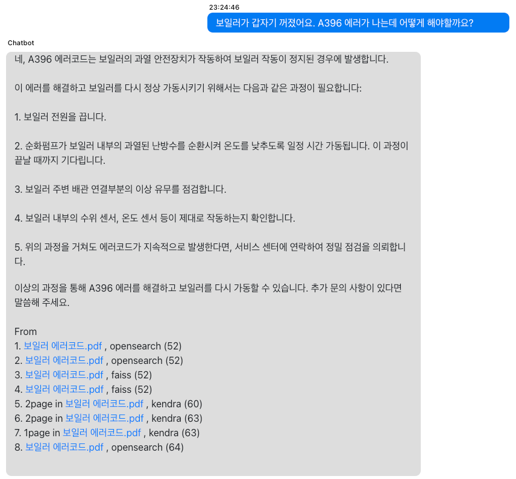

# Multi-RAG와 Multi-Region LLM로 한국어 Chatbot 만들기 

사전학습(pretrained)되지 않은 데이터나 민감한 정보를 가지고 있어서 사전학습 할수 없는 기업의 중요한 데이터는 [RAG(Retrieval-Augmented Generation)](https://docs.aws.amazon.com/ko_kr/sagemaker/latest/dg/jumpstart-foundation-models-customize-rag.html)을 이용하여 LLM(Large Language Model)에서 이용될 수 있습니다. RAG는 지식저장소(Knowledge Store)의 연관성 검색(sementic search)을 이용해, 질문과 가장 가까운 문서를 [LLM의 context](https://aws.amazon.com/ko/blogs/tech/sagemaker-jumpstart-vector-store-llama2-chatbot/)로 활용합니다. 이러한 지식저장소에는 대표적인 In-memory vector store인 [Faiss](https://github.com/facebookresearch/faiss/wiki/Getting-started), persistent store이면서 대용량 병렬처리가 가능한 [Amazon OpenSearch](https://docs.aws.amazon.com/ko_kr/opensearch-service/latest/developerguide/what-is.html)와 완전관리형 검색서비스인 [Amazon Kendra](https://aws.amazon.com/ko/kendra/features/)가 있습니다. 또한, [2023년 re:Invent](https://reinvent.awsevents.com/)에서는 [Amazon Aurora](https://aws.amazon.com/ko/rds/aurora/), OpenSearch, Kendra뿐 아니라 [Amazon Document DB](https://aws.amazon.com/ko/documentdb/), [Amazon Neptune](https://aws.amazon.com/ko/neptune/)등 거의 모든 데이터베이스의 RAG 지원이 발표되었으므로, 향후 다양한 Database가 RAG의 지식저장소로 활용될 수 있을것으로 기대됩니다.

Amazon Bedrock은 On-Demand와 Provisioned 방식으로  나누어 [Request와 Tokens 수](https://docs.aws.amazon.com/bedrock/latest/userguide/quotas.html)를 제한하고 있습니다. On-Demand 방식은 사용한 만큼만 과금하는 방식으로 LLM 어플리케이션 개발 및 초기 사업화시 Provisoned 방식 대비 유용합니다. Bedrock은 리전을 선택할 수 있으므로, Multi-Region 환경에서 여러 리전을 이용하여 On-Demand 방식의 허용 용량을 증대시킬 수 있습니다. 본 게시글은 Multi-Region의 [Claude LLM(Large Language Models)](https://aws.amazon.com/ko/bedrock/claude/)을 이용하여, 여러 종류의 [지식저장소(Knowledge Store)](https://aws.amazon.com/ko/about-aws/whats-new/2023/09/knowledge-base-amazon-bedrock-models-data-sources/)를 RAG로 활용하는 방법을 설명합니다.

Multi-RAG와 Multi-Region를 구현하기 위해서는 아래와 같은 기능을 구현하여야 합니다. 

- 2023년 11월 출시된 [Claude2.1](https://aws.amazon.com/ko/about-aws/whats-new/2023/11/claude-2-1-foundation-model-anthropic-amazon-bedrock/)은 context window로 200k tokens을 제공하므로 기존 대비 더 많은 RAG 문서를 활용할 수 있게 되었습니다. 하지만, Multi-RAG에서는 RAG의 숫자만큼 관련 문서(Relevant Documents)의 수가 증가하므로 Claud2.1을 활용하더라도 RAG 문서의 숫자를 제한할 필요가 있습니다. 또한 RAG의 용도 또는 RAG에 저장된 데이터의 차이에 따라서 어떤 RAG는 원했던 관련된 문서를 주지 못하거나 관련성이 적은 문서를 줄 수 있고, [관련 문서의 순서나 위치](https://www.anthropic.com/index/claude-2-1-prompting)는 LLM의 결과에 큰 영향을 주므로, 관련도가 높은 문서가 context의 상단에 있을수 있도록 배치할 수 있어야 합니다. 따라서, 각 RAG가 조회한 관련 문서들을 context window 크기에 맞게 선택하고, 중요도에 따라 순서대로 선택하여 하나의 context로 만들수 있어야 합니다. 

- Chatbot에서 질문후 답변까지의 시간은 사용성에 매우 중요한 요소입니다. 여러개의 RAG를 순차적으로 Query를 하면, RAG의 숫자만큼 지연시간이 늘어나게 됩니다. 따라서, RAG에 대한 Query를 병렬로 수행하여 지연시간을 단축할 수 있어야 합니다. 

- Amazon Bedrock은 API 기반이므로 다른 리전의 Bedcok을 이용할 수 있지만, 동적으로 사용하기 위한 로드밸런싱(load balancing)이 필요합니다. 

## 아키텍처 개요

전체적인 아키텍처는 아래와 같습니다. Web으로 제공되는 대화창에서 메시지를 입력하면 Websocket 방식을 지원하는 [Amazon API Gateway](https://docs.aws.amazon.com/ko_kr/apigateway/latest/developerguide/welcome.html)를 통해 [lambda(chat)](./lambda-chat-ws/lambda_function.py)에서 메시지를 처리합니다. 여기에서는 Multi-RAG로 Faiss, OpenSearch, Kendra를 사용합니다. Faiss는 lambda(chat)의 프로세스와 메모리를 활용하고, Amazon Kendra와 OpenSearch는 [AWS CDK](https://docs.aws.amazon.com/ko_kr/cdk/v2/guide/home.html)를 이용해 설치합니다. 대화이력은 [Amazon DynamoDB](https://docs.aws.amazon.com/ko_kr/amazondynamodb/latest/developerguide/GettingStartedDynamoDB.html)을 이용해 json 포맷으로 저장하고 관리합니다. Multi-Region으로는 N.Virginia(us-east-1)과 Oregon(us-west-2) 리전를 활용하는데, AWS의 다른 Bedrock 리전을 추가하여 사용할 수 있습니다.



상세하게 단계별로 설명하면 아래와 같습니다.

단계1: 채팅창에 사용자가 메시지를 입력하면, [Amazon API Gateway](https://docs.aws.amazon.com/ko_kr/apigateway/latest/developerguide/welcome.html)를 통해 [lambda(chat)](./lambda-chat-ws/lambda_function.py)에 event로 메시지가 전달됩니다.

단계2: [lambda(chat)](./lambda-chat-ws/lambda_function.py)은 기존 대화이력을 DynamoDB에서 읽어오고, Assistant와의 상호작용(interaction)을 고려한 새로운 질문(Revised Question)을 생성합니다. 이때 DynamoDB에서 대화이력을 가져오는 동작은 최초 1회만 수행합니다.

단계3: RAG를 위한 지식저장소(Knowledge Store)인 Faiss, Amazon Kendra, Amazon OpenSearch로 부터 관련된 문서(Relevant Documents)를 조회합니다. 각 RAG로 부터 수집된 관련된 문서들(Relevant Documents)은 새로운 질문(Revised Question)과의 관련성에 따라 재배치하여, 선택된 관련된 문서(Selected Relevant Documents)를 생성합니다.

단계4: Bedrock의 Claude LLM에 새로운 질문과 선택된 관련된 문서(Select Relevant Documents)를 전달합니다. 이때, 각 event는 us-east-1과 us-west-2의 Bedrock으로 번갈아서 요청을 보냅니다.

단계5: lambda(chat)은 LLM의 응답을 Dialog로 저장하고, 사용자에게 답변을 전달합니다.

단계6: 사용자는 답변을 확인하고, 필요시 Amazon S3에 저장된 문서를 Amazon CloudFront를 이용해 안전하게 보여줍니다. 


이때의 Sequence diagram은 아래와 같습니다. lambda(chat)은 하나의 질문(question)을 위해 2번의 LLM query와 3개의 지식 저장소에 대한 RAG query 동작을 수행합니다. DynamoDB로 부터 대화이력을 읽어오는 과정은 첫번째 event에 대해서만 수행하고 이후로는 Lambda의 내부 메모리에 대화이력을 저장후 활용합니다.




## 주요 구성

### Multi-Region 환경 구성

Multi-Region 환경에서 lambda(chat)로 들어온 event를 각각의 LLM으로 분산 할 수 있어야 합니다. [ALB/NLB](https://docs.aws.amazon.com/ko_kr/elasticloadbalancing/latest/userguide/how-elastic-load-balancing-works.html)은 Regional service이므로 이런 용도에 맞지 않으며, [Fan-out을 제공하는 SNS](https://docs.aws.amazon.com/sns/latest/dg/sns-common-scenarios.html)는 질문후 답변까지의 시간이 추가될 수 있습니다. 따라서 Multi-Region에 맞게 LangChain의 LLM client를 재설정하는 방식으로 [Round-robin scheduling](https://en.wikipedia.org/wiki/Round-robin_scheduling)을 구현합니다. 여기서는 "us-east-1"과, "us-west-2"를 이용해 Multi-Region을 구성하고 동적으로 할당하여 사용하는 방법을 설명합니다. 

[cdk-multi-rag-chatbot-stack.ts](./cdk-multi-rag-chatbot/lib/cdk-multi-rag-chatbot-stack.ts)에서는 아래와 같이 LLM의 profile을 저장한 후에 LLM을 처리하는 [lambda(chat)](./lambda-chat-ws/lambda_function.py)에 관련 정보를 Environment variables로 전달합니다. 여기서는 "us-west-2"와, "us-east-1"의 Claude2.1을 사용할 수 있도록 profile을 설정하고 있습니다. 

```typescript
const profile_of_LLMs = JSON.stringify([
  {
    "bedrock_region": "us-west-2",
    "model_type": "claude",
    "model_id": "anthropic.claude-v2:1",
    "maxOutputTokens": "8196"
  },
  {
    "bedrock_region": "us-east-1",
    "model_type": "claude",
    "model_id": "anthropic.claude-v2:1",
    "maxOutputTokens": "8196"
  },
]);
```

사용자가 보낸 메시지가 lambda(chat)에 event로 전달되면 아래와 같이 [boto3로 bedrock client](https://boto3.amazonaws.com/v1/documentation/api/latest/reference/services/bedrock-runtime.html)를 정의한 후에, LangChain으로 [Bedrock](https://api.python.langchain.com/en/latest/llms/langchain.llms.bedrock.Bedrock.html?highlight=bedrock#)과 [BedrockEmbeddings](https://api.python.langchain.com/en/latest/embeddings/langchain.embeddings.bedrock.BedrockEmbeddings.html)를 llm과 embeddings을 정의합니다. LLM의 리전(region)과 모델(medelId) 정보는 LLM profile로 관리되므로, lambda(chat)에 전달되는 event는 매번 다른 profile을 이용하게 됩니다.

```python
profile_of_LLMs = json.loads(os.environ.get('profile_of_LLMs'))
selected_LLM = 0

profile = profile_of_LLMs[selected_LLM]
bedrock_region = profile['bedrock_region']
modelId = profile['model_id']

boto3_bedrock = boto3.client(
    service_name = 'bedrock-runtime',
    region_name = bedrock_region,
    config = Config(
        retries = {
            'max_attempts': 30
        }
    )
)
parameters = get_parameter(profile['model_type'], int(profile['maxOutputTokens']))

llm = Bedrock(
    model_id = modelId,
    client = boto3_bedrock,
    streaming = True,
    callbacks = [StreamingStdOutCallbackHandler()],
    model_kwargs = parameters)

bedrock_embeddings = BedrockEmbeddings(
    client = boto3_bedrock,
    region_name = bedrock_region,
    model_id = 'amazon.titan-embed-text-v1'
)      
```

아래와 같이 Lambda(chat)은 event를 받을때마다 아래와 같이 새로운 LLM으로 교차하게되므로, N개의 리전을 활용하면, N배의 용량이 증가하게 됩니다. 

```python
if selected_LLM >= number_of_LLMs - 1:
    selected_LLM = 0
else:
    selected_LLM = selected_LLM + 1
```


### 지식저장소(Knowledge Store)에서 관련된 문서 가져오기

Mult-RAG에서는 다양한 지식저장소(Knowledge Store)를 RAG로 활용함으로써 관련된 문서를 검색할 수 있는 확율을 높이고, 여러 곳에 분산되어 저장된 문서를 RAG의 데이터소스로 활용할 수 있는 기회를 제공합니다.
여기서는 지식저장소로 OpenSearch, Faiss, Kendra를 활용합니다. Knowledge Store는 application에 맞게 추가하거나 제외할 수 있습니다.

#### OpenSearch

[OpenSearchVectorSearch](https://api.python.langchain.com/en/latest/vectorstores/langchain.vectorstores.opensearch_vector_search.OpenSearchVectorSearch.html)을 이용해 vector store를 정의합니다. 

```python
from langchain.vectorstores import OpenSearchVectorSearch

vectorstore_opensearch = OpenSearchVectorSearch(
    index_name = "rag-index-*", # all
    is_aoss = False,
    ef_search = 1024, # 512(default )
    m = 48,
    embedding_function = bedrock_embeddings,
    opensearch_url = opensearch_url,
    http_auth = (opensearch_account, opensearch_passwd), # http_auth = awsauth,
)
```

데이터는 아래와 같이 [add_documents()](https://api.python.langchain.com/en/latest/vectorstores/langchain.vectorstores.opensearch_vector_search.OpenSearchVectorSearch.html?highlight=opensearchvectorsearch#langchain.vectorstores.opensearch_vector_search.OpenSearchVectorSearch.add_documents)로 넣을 수 있습니다. index에 userId를 넣으면, 필용시 특정 사용자가 올린 문서만을 참조할 수 있습니다. 

```python
def store_document_for_opensearch(bedrock_embeddings, docs, userId, requestId):
    new_vectorstore = OpenSearchVectorSearch(
        index_name="rag-index-"+userId+'-'+requestId,
        is_aoss = False,
        embedding_function = bedrock_embeddings,
        opensearch_url = opensearch_url,
        http_auth=(opensearch_account, opensearch_passwd),
    )
    new_vectorstore.add_documents(docs)    
```

관련된 문서(relevant docs)는 아래처럼 검색할 수 있습니다. 문서가 검색이 되면 아래와 같이 metadata에서 문서의 이름(title), 페이지 번호(_excerpt_page_number), 파일의 경로(source) 및 발췌문(excerpt)를 추출해서 관련된 문서(Relevant Document)에 메타 정보로 추가할 수 있습니다. OpenSearch에 Query할 때에 [similarity_search_with_score](https://api.python.langchain.com/en/latest/vectorstores/langchain.vectorstores.opensearch_vector_search.OpenSearchVectorSearch.html#langchain.vectorstores.opensearch_vector_search.OpenSearchVectorSearch.similarity_search_with_score)를 사용하면, 결과값의 신뢰도를 score로 구할 수 있는데, "0.008877229"와 같이 1보다 작은 실수로 표현됩니다. 

```python
relevant_documents = vectorstore_opensearch.similarity_search_with_score(
    query = query,
    k = top_k,
)

for i, document in enumerate(relevant_documents):
    name = document[0].metadata['name']
    page = document[0].metadata['page']
    uri = document[0].metadata['uri']

    excerpt = document[0].page_content
    confidence = str(document[1])
    assessed_score = str(document[1])

    doc_info = {
        "rag_type": rag_type,
        "confidence": confidence,
        "metadata": {
            "source": uri,
            "title": name,
            "excerpt": excerpt,
            "document_attributes": {
                "_excerpt_page_number": page
            }
        },
        "assessed_score": assessed_score,
    }
    relevant_docs.append(doc_info)

return relevant_docs
```

#### Faiss

아래와 같이 Faiss는 문서를 처음 등록할 때에 vector store로 정의합니다. 이후로 추가되는 문서는 아래처럼 [add_documents()](https://api.python.langchain.com/en/latest/vectorstores/langchain.vectorstores.faiss.FAISS.html?highlight=faiss#langchain.vectorstores.faiss.FAISS.add_documents)를 이용해 추가합니다. Faiss는 in-memory vector store이므로, Faiss에 저장한 문서는 Lambda 인스턴스가 유지될 동안만 사용할 수 있습니다. 

```python
if isReady == False:
    embeddings = bedrock_embeddings
    vectorstore_faiss = FAISS.from_documents( 
        docs,  # documents
        embeddings  # embeddings
    )
    isReady = True
else:
    vectorstore_faiss.add_documents(docs)    
```

Faiss의 [similarity_search_with_score()](https://api.python.langchain.com/en/latest/vectorstores/langchain.vectorstores.faiss.FAISS.html#langchain.vectorstores.faiss.FAISS.similarity_search_with_score)를 이용하면 similarity에 대한 score를 얻을 수 있습니다. Faiss는 관련도가 높은 순서로 문서를 전달하는데, 관련도가 높을 수도록 score의 값는 작은값을 가집니다. 문서에서 이름(title), 페이지(_excerpt_page_number), 신뢰도(assessed_score), 발췌문(excerpt)을 추출합니다. Faiss의 score는 56와 같은 1보다 큰 값을 가집니다.

```python
relevant_documents = vectorstore_faiss.similarity_search_with_score(
    query = query,
    k = top_k,
)

for i, document in enumerate(relevant_documents):    
    name = document[0].metadata['name']
    page = document[0].metadata['page']
    uri = document[0].metadata['uri']
    confidence = int(document[1])
    assessed_score = int(document[1])

    doc_info = {
        "rag_type": rag_type,
        "confidence": confidence,
        "metadata": {
            "source": uri,
            "title": name,
            "excerpt": document[0].page_content,
            "document_attributes": {
                "_excerpt_page_number": page
            }
        },
        "assessed_score": assessed_score,
    }
```


#### Kendra

Kendra에 문서를 넣을 때는 아래와 같이 S3 bucket을 이용합니다. 문서의 경로(source_uri)는 CloudFront와 연결된 S3의 경로를 이용해 구할 수 있는데, 파일명은 URL encoding을 하여야 합니다. Kendra에 저장되는 문서는 아래와 같은 파일포맷으로 표현되어야 하며, [boto3의 batch_put_document()](https://boto3.amazonaws.com/v1/documentation/api/latest/reference/services/kendra/client/batch_put_document.html)을 이용해 등록합니다. 


```python
def store_document_for_kendra(path, s3_file_name, requestId):
    encoded_name = parse.quote(s3_file_name)
    source_uri = path + encoded_name    
    ext = (s3_file_name[s3_file_name.rfind('.')+1:len(s3_file_name)]).upper()

    # PLAIN_TEXT, XSLT, MS_WORD, RTF, CSV, JSON, HTML, PDF, PPT, MD, XML, MS_EXCEL
    if(ext == 'PPTX'):
        file_type = 'PPT'
    elif(ext == 'TXT'):
        file_type = 'PLAIN_TEXT'         
    elif(ext == 'XLS' or ext == 'XLSX'):
        file_type = 'MS_EXCEL'      
    elif(ext == 'DOC' or ext == 'DOCX'):
        file_type = 'MS_WORD'
    else:
        file_type = ext

    kendra_client = boto3.client(
        service_name='kendra', 
        region_name=kendra_region,
        config = Config(
            retries=dict(
                max_attempts=10
            )
        )
    )

    documents = [
        {
            "Id": requestId,
            "Title": s3_file_name,
            "S3Path": {
                "Bucket": s3_bucket,
                "Key": s3_prefix+'/'+s3_file_name
            },
            "Attributes": [
                {
                    "Key": '_source_uri',
                    'Value': {
                        'StringValue': source_uri
                    }
                },
                {
                    "Key": '_language_code',
                    'Value': {
                        'StringValue': "ko"
                    }
                },
            ],
            "ContentType": file_type
        }
    ]

    result = kendra_client.batch_put_document(
        IndexId = kendraIndex,
        RoleArn = roleArn,
        Documents = documents       
    )
```    

LangChain의 [Kendra Retriever](https://api.python.langchain.com/en/latest/retrievers/langchain.retrievers.kendra.AmazonKendraRetriever.html)를 이용하여, 아래와 같이 Kendra Retriever를 생성합니다. 파일을 등록할 때와 동일하게 "_language_code"을 "ko"로 설정합니다.

```python
from langchain.retrievers import AmazonKendraRetriever
kendraRetriever = AmazonKendraRetriever(
    index_id=kendraIndex, 
    region_name=kendra_region,
    attribute_filter = {
        "EqualsTo": {      
            "Key": "_language_code",
            "Value": {
                "StringValue": "ko"
            }
        },
    },
)
```

Kendra의 [get_relevant_documents()](https://api.python.langchain.com/en/latest/retrievers/langchain.retrievers.kendra.AmazonKendraRetriever.html)을 이용하여 "top_k"개의 질문(query)과 관련된 문서들(Relevant Documents)를 가져옵니다. 

```python
rag_type = "kendra"
api_type = "kendraRetriever"
relevant_docs = []
relevant_documents = kendraRetriever.get_relevant_documents(
    query = query,
    top_k = top_k,
)

for i, document in enumerate(relevant_documents):
    result_id = document.metadata['result_id']
    document_id = document.metadata['document_id']
    title = document.metadata['title']
    excerpt = document.metadata['excerpt']
    uri = document.metadata['document_attributes']['_source_uri']
    page = document.metadata['document_attributes']['_excerpt_page_number']
    assessed_score = ""

    doc_info = {
        "rag_type": rag_type,
        "api_type": api_type,
        "metadata": {
            "document_id": document_id,
            "source": uri,
            "title": title,
            "excerpt": excerpt,
            "document_attributes": {
                "_excerpt_page_number": page
            }
        },
        "assessed_score": assessed_score,
        "result_id": result_id
    }
    relevant_docs.append(doc_info)

return relevant_docs
```


### 대화이력을 고려하여 새로운 질문 생성하기

Assistent와 상호작용(interacton)을 위하여 대화이력을 이용해 사용자의 질문을 새로운 질문(revised_question)으로 업데이트합니다. 이때 사용하는 prompt는 한국어와 영어로 나누어 아래처럼 적용하고 있습니다. 

```python
revised_question = get_revised_question(llm, connectionId, requestId, text) # generate new prompt 

def get_revised_question(llm, connectionId, requestId, query):    
    pattern_hangul = re.compile('[\u3131-\u3163\uac00-\ud7a3]+')
    word_kor = pattern_hangul.search(str(query))

    if word_kor and word_kor != 'None':
        condense_template = """
        <history>
        {chat_history}
        </history>

        Human: <history>를 참조하여, 다음의 <question>의 뜻을 명확히 하는 새로운 질문을 한국어로 생성하세요.

        <question>            
        {question}
        </question>
            
        Assistant: 새로운 질문:"""
    else: 
        condense_template = """
        <history>
        {chat_history}
        </history>
        Answer only with the new question.

        Human: using <history>, rephrase the follow up <question> to be a standalone question.
         
        <quesion>
        {question}
        </question>

        Assistant: Standalone question:"""

    condense_prompt_claude = PromptTemplate.from_template(condense_template)        
    condense_prompt_chain = LLMChain(llm=llm, prompt=condense_prompt_claude)

    chat_history = extract_chat_history_from_memory()
    revised_question = condense_prompt_chain.run({"chat_history": chat_history, "question": query})
    
    return revised_question
```

### Multi-RAG를 병렬로 조회하기

Kendra와 Vector Store인 Faiss, OpenSearch에서 "top_k"개 만큼 질문(query)와 관련된 문서를 가져옵니다. 병렬로 조회하기 위하여, [Lambda의 Multi thread](https://aws.amazon.com/ko/blogs/compute/parallel-processing-in-python-with-aws-lambda/)를 이용합니다. 이때, 병렬 처리된 데이터를 처리할때에는 
[Lambda-Parallel Processing](https://aws.amazon.com/ko/blogs/compute/parallel-processing-in-python-with-aws-lambda/)와 같이 [Pipe()](https://docs.python.org/3/library/multiprocessing.html)을 이용합니다. 이와같이 multiprocessing을 이용해해 여러개의 thread를 동시에 실행함으로써, RAG로 인한 지연시간을 최소화할 수 있습니다. 

```python
from multiprocessing import Process, Pipe

processes = []
parent_connections = []
for rag in capabilities:
    parent_conn, child_conn = Pipe()
    parent_connections.append(parent_conn)

    process = Process(target = retrieve_process_from_RAG, args = (child_conn, revised_question, top_k, rag))
    processes.append(process)

for process in processes:
    process.start()

for parent_conn in parent_connections:
    rel_docs = parent_conn.recv()

    if (len(rel_docs) >= 1):
        for doc in rel_docs:
            relevant_docs.append(doc)

for process in processes:
    process.join()

def retrieve_process_from_RAG(conn, query, top_k, rag_type):
    relevant_docs = []
    if rag_type == 'kendra':
        rel_docs = retrieve_from_kendra(query=query, top_k=top_k)      
    else:
        rel_docs = retrieve_from_vectorstore(query=query, top_k=top_k, rag_type=rag_type)
    
    if(len(rel_docs)>=1):
        for doc in rel_docs:
            relevant_docs.append(doc)    
    
    conn.send(relevant_docs)
    conn.close()
```

### RAG의 결과를 신뢰도에 따라 정렬하기

Multi-RAG로 얻은 관련 문서들(Relevant Documents)을 신뢰도에 따라 순서대로 정리한 후에 context로 사용하고자 합니다. RAG 방식에 따라서 결과의 신뢰를 나타내는 score를 주기도 하는데, RAG마다 결과를 측정하는 방법이 달라서, RAG의 문서를 신뢰도에 맞추기 위해 다시 관련된 문서를 평가하고 재배치하는 과정이 필요합니다. 여기서는 In-memory 방식의 Faiss를 이용하여 각 RAG가 전달한 문서들중에 가장 질문과 가까운 문서들을 고릅니다. In-memory 방식은 Lambda의 프로세스와 메모리를 활용하므로 추가적인 비용이 발생하지 않으며 속도도 빠릅니다. 

아래의 check_confidence()와 같이 Faiss, OpenSearch, Kendra가 검색한 관련된 문서를 Faiss에 문서로 등록합니다. 이후 Faiss의 similarity search를 이용하여, top_k의 문서를 다시 고르는데, assessed_score가 200이하인 문서를 선택하여 선택된 관련 문서(selected_relevant_docs)로 활용합니다.

```python
if len(relevant_docs) >= 1:
    selected_relevant_docs = priority_search(revised_question, relevant_docs, bedrock_embeddings)

def priority_search(query, relevant_docs, bedrock_embeddings):
    excerpts = []
    for i, doc in enumerate(relevant_docs):
        excerpts.append(
            Document(
                page_content=doc['metadata']['excerpt'],
                metadata={
                    'name': doc['metadata']['title'],
                    'order':i,
                }
            )
        )  

    embeddings = bedrock_embeddings
    vectorstore_confidence = FAISS.from_documents(
        excerpts,  # documents
        embeddings  # embeddings
    )            
    rel_documents = vectorstore_confidence.similarity_search_with_score(
        query=query,
        k=top_k
    )

    docs = []
    for i, document in enumerate(rel_documents):
        order = document[0].metadata['order']
        name = document[0].metadata['name']
        assessed_score = document[1]

        relevant_docs[order]['assessed_score'] = int(assessed_score)

        if assessed_score < 200:
            docs.append(relevant_docs[order])    

    return docs
```

선택된 관련된 문서들을 아래와 같이 하나의 context로 모읍니다. 이후 RAG용 PROMPT에 새로운 질문(revised_question)과 선택된 관련 문서(selected_relevant_docs)을 함께 넣어서 LLM에 답변을 요청합니다. 이후 답변은 stream으로 화면에 보여줍니다.

```python
relevant_context = ""
for document in relevant_docs:
    relevant_context = relevant_context + document['metadata']['excerpt'] + "\n\n"

stream = llm(PROMPT.format(context=relevant_context, question=revised_question))
msg = readStreamMsg(connectionId, requestId, stream)
```


### Reference 표시하기

아래와 같이 Kendra는 doc의 metadata에서 reference에 대한 정보를 추출합니다. 여기서 file의 이름은 doc.metadata['title']을 이용하고, 페이지는 doc.metadata['document_attributes']['_excerpt_page_number']을 이용해 얻습니다. 

```python
def get_reference(docs):
    reference = "\n\nFrom\n"    
    for i, doc in enumerate(docs):
        page = ""
        if "document_attributes" in doc['metadata']:
            if "_excerpt_page_number" in doc['metadata']['document_attributes']:
                page = doc['metadata']['document_attributes']['_excerpt_page_number']
        uri = doc['metadata']['source']
        name = doc['metadata']['title']
        if page: 
            reference = reference + f"{i+1}. {page}page in <a href={uri} target=_blank>{name} </a>, {doc['rag_type']} ({doc['assessed_score']})\n"
        else:
            reference = reference + f"{i+1}. <a href={uri} target=_blank>{name} </a>, {doc['rag_type']} ({doc['assessed_score']})\n"
    return reference
```


### AWS CDK로 인프라 구현하기

[CDK 구현 코드](./cdk-multi-rag-chatbot/README.md)에서는 Typescript로 인프라를 정의하는 방법에 대해 상세히 설명하고 있습니다.

## 직접 실습 해보기

### 사전 준비 사항

이 솔루션을 사용하기 위해서는 사전에 아래와 같은 준비가 되어야 합니다.

- [AWS Account 생성](https://repost.aws/ko/knowledge-center/create-and-activate-aws-account)


### CDK를 이용한 인프라 설치
[인프라 설치](./deployment.md)에 따라 CDK로 인프라 설치를 진행합니다. 


### 실행결과

[error_code.pdf](https://raw.githubusercontent.com/kyopark2014/multi-rag-and-multi-region-llm-for-chatbot/main/contents/error_code.pdf) 파일을 다운로드 한 후에, 채팅 화면 하단의 파일 아이콘을 선택하여 업로드합니다. 본 실습에서는 Multi-RAG 동작을 테스트하기 위하여 파일 업로드시 모든 RAG에 문서로 등록하도록 구성하였습니다. 실사용시에는 RAG 별로 다른 데이터가 저장될것으로 예상됩니다. 업로드가 완료되면 파일 내용을 요약하여 보여줍니다. 

이후 채팅창에 "보일러가 갑자기 꺼졌어요. A396 에러가 나는데 어떻게 해야할까요?"라고 입력한 후에 결과를 확인합니다. "From" 이하로 아래와 같이 Faiss, Kendra, OpenSearch로 검색한 정보가 표시됩니다. 여기서 오른쪽 괄호 안에는 Faiss로 얻은 similarity search 결과가 점수로 표시되는데 점수가 낮을수록 더 신뢰도가 있습니다. 



대용량 언어 모델(LLM)의 특성상 실습의 답변은 상기 화면과 조금 다를 수 있습니다. 최초 실행시 접속에 실패하면 브라우저를 새로고침하고 질문을 재입력합니다. 또한, From에 Kendra 결과가 보여지지 않으면, index 작업이 끝나지 않은것이므로 수분후에 재시도 합니다.

## 리소스 정리하기 

더이상 인프라를 사용하지 않는 경우에 아래처럼 모든 리소스를 삭제할 수 있습니다. 

1) [API Gateway Console](https://ap-northeast-1.console.aws.amazon.com/apigateway/main/apis?region=ap-northeast-1)로 접속하여 "api-chatbot-for-multi-rag-chatbot", "api-multi-rag-chatbot"을 삭제합니다.

2) [Cloud9 console](https://ap-northeast-1.console.aws.amazon.com/cloud9control/home?region=ap-northeast-1#/)에 접속하여 아래의 명령어로 전체 삭제를 합니다.


```text
cd ~/environment/multi-rag-and-multi-region-llm-for-chatbot/cdk-multi-rag-chatbot/ && cdk destroy --all
```


## 결론

다양한 지식저장소(Knowledge Store)를 이용하여 RAG를 구성할 수 있도록 Multi-RAG를 구현하는 방법에 대해 설명하였습니다. Multi-RAG로 얻어진 여러 RAG의 관련 문서(Relevant Documents)들은 질문에 대한 관련도(similarity)에 따라 정렬하였고, 지연시간을 최소화하기 위하여 병렬처리하는 방법을 소개 하였습니다. 또한 Multi-Region 환경을 구성하여 여러 리전의 LLM을 효율적으로 사용하여 On-Demend 방식의 용량 이슈를 완화할 수 있었습니다. 본 게시글에서 사용한 Architecture는 서버리스 서비스들을 이용하였으므로, RAG를 이용한 LLM 어플리케이션을 편리하게 개발하고 유지보수에 대한 부담없이 운영할 수 있습니다. 근래에 기업이 보유한 데이터를 잘 활용하기 위하여 Amazon Q와 같은 서비스들이 활용되고 있습니다. 본 게시글에서 제안하는 Multi-RAG와 Multi-Region 구조는 기업의 다양한 데이터베이스를 통합하여, 업무를 간소화하고 빠른 의사결정 및 문제를 해결할 수 있는 어플리케이션 개발에 활용될 수 있을것으로 보여집니다.


## 실습 코드 및 도움이 되는 참조 블로그

아래의 링크에서 실습 소스 파일 및 기계 학습(ML)과 관련된 자료를 확인하실 수 있습니다.

- [Amazon SageMaker JumpStart를 이용하여 Falcon Foundation Model기반의 Chatbot 만들기](https://aws.amazon.com/ko/blogs/tech/chatbot-based-on-falcon-fm/)
- [Amazon SageMaker JumpStart와 Vector Store를 이용하여 Llama 2로 Chatbot 만들기](https://aws.amazon.com/ko/blogs/tech/sagemaker-jumpstart-vector-store-llama2-chatbot/)
- [VARCO LLM과 Amazon OpenSearch를 이용하여 한국어 Chatbot 만들기](https://aws.amazon.com/ko/blogs/tech/korean-chatbot-using-varco-llm-and-opensearch/)
- [Amazon Bedrock을 이용하여 Stream 방식의 한국어 Chatbot 구현하기](https://aws.amazon.com/ko/blogs/tech/stream-chatbot-for-amazon-bedrock/)


