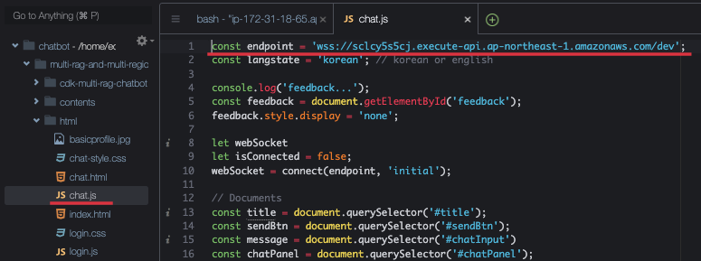
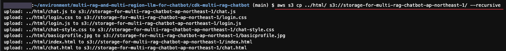
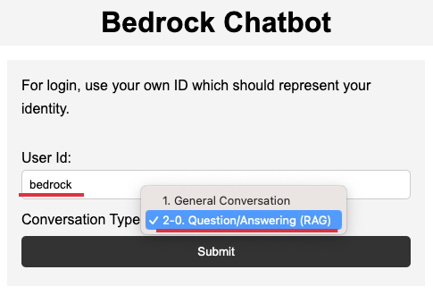

# 인프라 설치하기

## Bedrock 사용 권한 설정하기

Bedrock은 Virginia(us-east-1)과 Oregon(us-west-2) 리전을 사용합니다. [Model access - Virginia](https://us-east-1.console.aws.amazon.com/bedrock/home?region=us-east-1#/modelaccess)과 [Model access - Oregon](https://us-west-2.console.aws.amazon.com/bedrock/home?region=us-west-2#/modelaccess)에 접속해서 [Edit]를 선택하여 모든 모델을 사용할 수 있도록 설정합니다. 특히 Anthropic Claude와 "Titan Embeddings G1 - Text"은 LLM 및 Vector Embedding을 위해서 반드시 사용이 가능하여야 합니다.


## CDK를 이용한 인프라 설치하기

여기서는 [Cloud9](https://aws.amazon.com/ko/cloud9/)에서 [AWS CDK](https://aws.amazon.com/ko/cdk/)를 이용하여 인프라를 설치합니다.

1) [Cloud9 Console](https://ap-northeast-2.console.aws.amazon.com/cloud9control/home?region=ap-northeast-2#/create)에 접속하여 [Create environment]-[Name]에서 “chatbot”으로 이름을 입력하고, EC2 instance는 “m5.large”를 선택합니다. 나머지는 기본값을 유지하고, 하단으로 스크롤하여 [Create]를 선택합니다.


2) [Environment](https://ap-northeast-2.console.aws.amazon.com/cloud9control/home?region=ap-northeast-2#/)에서 “chatbot”를 [Open]한 후에 아래와 같이 터미널을 실행합니다.


3) EBS 크기 변경

아래와 같이 스크립트를 다운로드 합니다. 

```text
curl https://raw.githubusercontent.com/kyopark2014/technical-summary/main/resize.sh -o resize.sh
```

이후 아래 명령어로 용량을 80G로 변경합니다.
```text
chmod a+rx resize.sh && ./resize.sh 80
```


4) 소스를 다운로드합니다.

```java
git clone https://github.com/kyopark2014/multi-rag-and-multi-region-llm-for-chatbot
```

5) cdk 폴더로 이동하여 필요한 라이브러리를 설치합니다.

```java
cd multi-rag-and-multi-region-llm-for-chatbot/cdk-multi-rag-chatbot/ && npm install
```

6) CDK 사용을 위해 Boostraping을 수행합니다.

아래 명령어로 Account ID를 확인합니다.

```java
aws sts get-caller-identity --query Account --output text
```

아래와 같이 bootstrap을 수행합니다. 여기서 "account-id"는 상기 명령어로 확인한 12자리의 Account ID입니다. bootstrap 1회만 수행하면 되므로, 기존에 cdk를 사용하고 있었다면 bootstrap은 건너뛰어도 됩니다.

```java
cdk bootstrap aws://[Account ID]/ap-northeast-1
```

8) 인프라를 설치합니다.

```java
cdk deploy --all
```

설치가 완료되면 아래와 같은 Output이 나옵니다. 


9) Output의 websocketurl을 복사한 후, 'multi-rag-and-multi-region-llm-for-chatbot/html/'의 "chat.js"를 열어서 아래와 같이 endpoint를 업데이트 합니다.




9) HTMl 파일을 S3에 복사합니다.

아래와 같이 Output의 HtmlUpdateCommend을 붙여넣기 합니다. 




9) 11.	Output의 WebUrlformultiragchatbot에 있는 URL을 복사하여 웹 브라우저로 접속합니다. User Id로 적당한 이름을 넣고, Conversation Type로는 "2. Question/Answering (RAG)"를 선택합니다.
  
  



