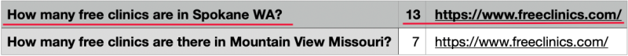

# Amazon Bedrock의 Claude와 Amazon Kendra를 이용하여 RAG가 적용된 Chatbot 만들기

[Amazon Bedrock의 Claude LLM v2.1](https://aws.amazon.com/ko/about-aws/whats-new/2023/11/claude-2-1-foundation-model-anthropic-amazon-bedrock/)은 200k token을 가지는 Context Window를 제공하고, 환각(Hallucination) 방지에서도 높은 성능을 보여주고 있습니다. 또한, [Amazon Q](https://aws.amazon.com/ko/blogs/aws/introducing-amazon-q-a-new-generative-ai-powered-assistant-preview/)에서는 [Amazon Bedrock](https://aws.amazon.com/ko/bedrock/)과 [Amazon Kendra](https://aws.amazon.com/ko/kendra/)을 이용하여 다양한 데이터 소스를 통합하여 업무를 간소화하고, 빠른 의사결정 및 문제점 해결이 가능하도록, 즉각적이고 관련성 있는 정보와 조언을 제공하고 있습니다. 본 게시글에서는 Amazon Bedrock의 Claude LLM과 Amazon Kendra를 사용하여 RAG가 적용된 한국어 Chatbot을 만드는 것을 설명합니다. LLM과 어플리케이션의 인터페이스는 [LangChain](https://www.langchain.com/)을 이용하며, Kendra에서 제공하는 정보를 최대한 활용하여 [RAG (Retrieval Augmented Generation)](https://docs.aws.amazon.com/ko_kr/sagemaker/latest/dg/jumpstart-foundation-models-customize-rag.html)의 성능을 향상시킵니다. 이를 통해, 오픈된 개발환경에서, 기업의 데이터를 안전하고 효율적으로 사용하는 한국어 Chatbot을 만들수 있습니다. 

Kendra는 자연어 검색을 통해 RAG에 필요한 관련된 문서들(Relevant Documents)을 찾을 수 있습니다. 그러나, 만약 질문과 연관된 문장이 없다면, 가장 유사한 문장이 선택되므로, 때로는 관계가 높지 않은 문장이 관련된 문장으로 선택되어 RAG의 정확도에 영향을 줄 수 있습니다. 또한 Kendra에서 선택되는 문서들의 나누는 방식(chunk)에 따라서 원래 의미가 변경될 수 있으며, 유사한 문서가 많으면 정확한 답변을 가진 문서를 찾지 못할 수 있습니다. 만약 자주 사용되는 질문과 답변을 FAQ(Frequently Asked Questions)로 가지고 있다면, 다수의 문서를 검색해서 찾는것보다 더 정확한 답변을 할 수 있습니다. 이와같이 본 게시글에서는 Kendra가 검색한 문서들의 정확도([ScoreAttributes](https://docs.aws.amazon.com/kendra/latest/APIReference/API_ScoreAttributes.html))를 기준으로 RAG가 사용할 문장들을 선택하고, Kendra의 [FAQ((Frequently Asked Questions)](https://docs.aws.amazon.com/kendra/latest/dg/in-creating-faq.html#using-faq-file)를 우선적으로 활용하여, RAG의 정확도를 향상시키는 방법을 설명합니다. 

## Architecture 개요

아래 그림은 전체적인 Arhcitecture를 보여주고 있습니다. 사용자는 [Amazon CloudFront](https://aws.amazon.com/ko/cloudfront/)을 통해 채팅화면에 접속합니다. Client는 [Amazon API Gateway](https://docs.aws.amazon.com/ko_kr/apigateway/latest/developerguide/welcome.html)와 [AWS Lambda](https://docs.aws.amazon.com/lambda/latest/dg/welcome.html)를 통해 [Amazon DynamoDB](https://docs.aws.amazon.com/amazondynamodb/latest/developerguide/Introduction.html)에 저장된 대화이력을 가져와서 화면에 보여줄 수 있습니다. 사용자가 메시지를 입력하면 Web Socket을 처리하는 API Gateway를 통해 stream 방식으로 Chatbot과 대화를 할 수 있습니다. Lambda(chat)은 대화이력을 이용해 Assistant와 상호작용(interaction)을 할 수 있도록 하며, Kendra에서 질문과 관련된 문장(Relevant Documents)를 가져와서 RAG 동작을 수행합니다. 


채팅 창에서 텍스트 입력(Prompt)를 통해 Kendra로 RAG를 활용하는 과정은 아래와 같습니다.
1) 사용자가 CloudFront의 Domain으로 접속합니다.
2) 사용자가 로그인을 화면 이전 대화이력을 가져와서 화면에 보여줍니다.
3) 채팅창에서 질문(Question)을 입력합니다.
4) 질문은 Web Socket 방식으로 API Gateway을 통해 [lambda (chat)](./lambda-chat-ws/lambda_function.py)에 전달됩니다.
5) lambda(chat)은 사용자의 이전 대화이력이 있는지 확인하여 없다면, DynamoDB에서 로드하여 활용합니다.
6) lambda(chat)은 대화이력과 현재의 질문을 가지고 대화에 맞는 적절한 새로운 질문을 Bedrock을 통해 생성합니다.
7) lambda(chat)은 새로운 질문으로 Kendra로 부터 관련된 문장(Relevant Documents)가 있는지 확인합니다.
8) Kendra로 부터 얻은 관련된 문장과 새로운 질문으로 Bedrock에게 답변을 요청합니다.
9) Bedrock으로 부터 답변(Answer)을 얻으면 DyanmoDB의 대화이력을 업데이트하고, 사용자에게 답변을 전달합니다. 

아래에서는 상기의 동작을 Sequence Diagram으로 상세하게 설명하였습니다.


## 주요 시스템 구성

전체 시스템의 상세 구현에 대하여 아래와 같이 설명합니다.

### Bedrock의 Claude LLM을 LangChain으로 설정하기

[lambda-chat](./lambda-chat-ws/lambda_function.py)와 같이 Langchain으로 Bedrock을 정의할때, 아래와 같이 사용 리전을 설정하고, Anthropic의 Claude V2.1을 LLM으로 설정합니다. Stream 설정 및 WebSocket API 구현과 관련해서는 [Amazon Bedrock을 이용하여 Stream 방식의 한국어 Chatbot 구현하기](https://aws.amazon.com/ko/blogs/tech/stream-chatbot-for-amazon-bedrock/)을 참조합니다.

```python
modelId = 'anthropic.claude-v2:1’
bedrock_region = "us-west-2" 

boto3_bedrock = boto3.client(
    service_name='bedrock-runtime',
    region_name=bedrock_region,
    config=Config(
        retries = {
            'max_attempts': 30
        }            
    )
)

HUMAN_PROMPT = "\n\nHuman:"
AI_PROMPT = "\n\nAssistant:"
def get_parameter(modelId):
    if modelId == 'anthropic.claude-v2:1':
        return {
            "max_tokens_to_sample":8191, # 8k
            "temperature":0.1,
            "top_k":250,
            "top_p":0.9,
            "stop_sequences": [HUMAN_PROMPT]            
        }
parameters = get_parameter(modelId)

from langchain.llms.bedrock import Bedrock
llm = Bedrock(
    model_id=modelId, 
    client=boto3_bedrock, 
    streaming=True,
    callbacks=[StreamingStdOutCallbackHandler()],
    model_kwargs=parameters)
```

### Kendra 준비

AWS CDK를 이용하여 [Kendra 사용을 위한 준비](./kendra-preperation.md)와 같이 Kendra를 설치하고 사용할 준비를 합니다.


### 대화이력을 저장하기 위한 메모리 준비 및 Dialog 저장

사용자별로 대화이력을 관리하기 위하여 아래와 같이 map_chain을 정의합니다. 클라이언트의 요청이 Lambda에 event로 전달되면, event의 body에서 사용자 ID(user_id)를 추출하여 관련 대화이력을 가진 메모리 맵(map_chain)을 찾습니다. 기존 대화이력이 메모리 맵에 있다면 재활용하고, 없다면 아래와 같이 [ConversationBufferWindowMemory](https://api.python.langchain.com/en/latest/memory/langchain.memory.buffer_window.ConversationBufferWindowMemory.html)을 이용하여 새로 정의합니다. 상세한 코드는 [lambda-chat](./lambda-chat-ws/lambda_function.py)을 참고합니다.

```python
map_chain = dict()

jsonBody = json.loads(event.get("body"))
userId  = jsonBody['user_id']

if userId in map_chain:
    memory_chain = map_chain[userId]
else
    memory_chain = ConversationBufferWindowMemory(memory_key="chat_history",output_key='answer',return_messages=True,k=5)
    map_chain[userId] = memory_chain
```

LLM으로 부터 질문에 대한 답변을 얻으면, 아래와 같이 memory_chain에 새로운 dialog로 저장합니다.

```python
memory_chain.chat_memory.add_user_message(text)
memory_chain.chat_memory.add_ai_message(msg)
```

### Kendra에 문서 등록하기

RAG에 사용한 문서의 경로(URI)를 채팅화면에서 보여주면, 필요시 추가적인 정보를 쉽게 얻을 수 있으므로 사용성이 좋아집니다. 본 게시글의 실습에서는 CloudFront의 정적 저장소로 사용된 S3 Bucket에 파일을 업로드하므로, CloudFront의 도메인 주소와 파일명(key)을 이용하여 파일의 경로(URI)를 생성합니다. 이 경로는 문서 정보의 "source_uri"로 저장되어, 해당 문서가 관련 문서(Relevant Documents)로 사용될 때에 채팅 UI에 노출될 수 있습니다. 또한, 파일명("s3_file_name")에 공백이 있을 수 있으므로 URL Encoding을 하여야 하고, S3 Object의 파일 확장자를 추출하여 문서 타입을 정의합니다. 

Kendra가 사용할 수 있는 [문서 타입](https://docs.aws.amazon.com/kendra/latest/dg/index-document-types.html)에는 HTML, XML, TXT, CSV, JSON 뿐 아니라, Excel, Word, PowerPoint를 지원하며, 문서의 크기는 최대 50MB입니다. Kendra에 문서를 등록할 때에 언어를 지정하면, 추후 문서 검색시에 언어별로 나누어 검색을 할 수 있습니다. 따라서, 아래에서는 파일 속성으로 "_language_code"를 "ko"로 설정한 후에, [batch_put_document()](https://boto3.amazonaws.com/v1/documentation/api/latest/reference/services/kendra.html)을 이용하여 문서를 S3에 업로드합니다.

```java
from urllib import parse

def store_document_for_kendra(path, s3_file_name, requestId):
    encoded_name = parse.quote(s3_file_name)
    source_uri = path + encoded_name    

    ext = (s3_file_name[s3_file_name.rfind('.')+1:len(s3_file_name)]).upper()
    if(ext == 'PPTX'):
        file_type = 'PPT'
    elif(ext == 'TXT'):
        file_type = 'PLAIN_TEXT'         
    elif(ext == 'XLS' or ext == 'XLSX'):
        file_type = 'MS_EXCEL'      
    elif(ext == 'DOC' or ext == 'DOCX'):
        file_type = 'MS_WORD'
    else:
        file_type = ext

    kendra_client = boto3.client(
        service_name='kendra', 
        region_name=kendra_region,
        config = Config(
            retries=dict(
                max_attempts=10
            )
        )
    )

    documents = [
        {
            "Id": requestId,
            "Title": s3_file_name,
            "S3Path": {
                "Bucket": s3_bucket,
                "Key": s3_prefix+'/'+s3_file_name
            },
            "Attributes": [
                {
                    "Key": '_source_uri',
                    'Value': {
                        'StringValue': source_uri
                    }
                },
                {
                    "Key": '_language_code',
                    'Value': {
                        'StringValue': "ko"
                    }
                },
            ],
            "ContentType": file_type
        }
    ]

    kendra_client.batch_put_document(
        IndexId = kendraIndex,
        RoleArn = roleArn,
        Documents = documents       
    )
```


### FAQ 활용하기

[FAQ-Kendra](https://github.com/aws-samples/enterprise-search-with-amazon-kendra-workshop/blob/master/Part%202%20-%20Adding%20a%20FAQ.md)와 같이 Kendra Console에서 FAQ를 등록할 수 있습니다. 이때 [index당 등록할 수 있는 FAQ 문서의 수](https://us-west-2.console.aws.amazon.com/servicequotas/home/services/kendra/quotas/L-522F5A9C)는 기본이 30개이고 Quota는 조정이 가능합니다. 아래 그림은 FAQ의 한 예입니다. 만약 "How many free clinics are in Spokane WA?"와 같은 질문을 하면 답변으로 "13"을 얻을 수 있습니다.



Kendra의 FAQ로 질문을 하려면, Query API를 이용하여야 합니다. 이때, FAQ에 Query API의 결과는 "QUESTION_ANSWER"으로 내려오는데, 질문(QuestionText), 답변(AnswerText), URI(_source_uri)에 대한 정보뿐 아니라, [ScoreAttributes](https://docs.aws.amazon.com/kendra/latest/APIReference/API_ScoreAttributes.html)로 "VERY_HIGH", "HIGH", "MEDIUM", "LOW", "NOT_AVAILABLE"와 같은 결과의 신뢰도 값을 얻을 수 있습니다. 이러한 ScoreAttributes의 범위를 조정해서, 관련 문서를 선택적으로 사용할 수 있습니다.

```java
{
   "QueryId":"6ca1e9c4-9ce1-41f7-a527-2b6a536ad8b4",
   "ResultItems":[
      {
         "Id":"6ca1e9c4-9ce1-41f7-a527-2b6a536ad8b4-e1b952fa-7d3b-4290-ac5e-9f12b99db3af",
         "Type":"QUESTION_ANSWER",
         "Format":"TEXT",
         "AdditionalAttributes":[
            {
               "Key":"QuestionText",
               "ValueType":"TEXT_WITH_HIGHLIGHTS_VALUE",
               "Value":{
                  "TextWithHighlightsValue":{
                     "Text":"How many free clinics are in Spokane WA?",
                  }
               }
            },
            {
               "Key":"AnswerText",
               "ValueType":"TEXT_WITH_HIGHLIGHTS_VALUE",
               "Value":{
                  "TextWithHighlightsValue":{
                     "Text":"13",
                  }
               }
            }
         ],
         "DocumentId":"c24c0fe9cbdfa412ac58d1296d985a8c9a91f1b2c-e28b-4d13-8b01-8a33be5fc126",
         "DocumentURI":"https://www.freeclinics.com/",
         "DocumentAttributes":[
            {
               "Key":"_source_uri",
               "Value":{
                  "StringValue":"https://www.freeclinics.com/"
               }
            }
         ],
         "ScoreAttributes":{
            "ScoreConfidence":"VERY_HIGH"
         },
         "FeedbackToken":"AYADeLqxw- 중략 - sKl9Lud8b4-e1b952fa-7d3b-4290-ac5e-9f12b99db3af"
      }
   ],
   "TotalNumberOfResults":1,
}
```

상기의 FAQ 예제에서 "How many free clinics are in Spokane WA?"의 답변은 "13"이었습니다. 그런데, 사용자가 Kendra에 "How many clinics are in Spokane WA?"와 같이 "free"를 빼고 질문하면 완전히 다른 질문이 됩니다. 하지만, Kendra는 FAQ에서 가장 유사한 항목을 찾아서 답변으로 전달하므로, "free"를 빼고 질문하였을 때에 "13"이라는 잘못된 답변을 "VERY_HIGH"와 같은 신뢰도로 응답할 수 있습니다. 따라서, FAQ를 검색한 결과를 그대로 사용하지 않고, "How many free clinics are in Spokane WA? 13"와 같이 하나의 문장으로 만들어서, RAG에서 참조하는 관련 문서(Relevant Documents)로 사용하여야 합니다. 또한, Kendra의 FAQ는 Query API를 이용하므로, FAQ의 Answer가 길 경우에, 앞부분만 참조될 수 있습니다. 따라서, FAQ 문서를 Kendra의 Data Source에 추가로 등록하여 전체가 참고될 수 있도록 합니다. 


### LangChain의 활용

LangChain의 [RetrievalQA](https://api.python.langchain.com/en/latest/chains/langchain.chains.retrieval_qa.base.RetrievalQA.html?highlight=retrievalqa#)와 [ConversationalRetrievalChain](https://api.python.langchain.com/en/latest/chains/langchain.chains.conversational_retrieval.base.ConversationalRetrievalChain.html#)은 [kendra retriever](https://api.python.langchain.com/en/latest/retrievers/langchain.retrievers.kendra.AmazonKendraRetriever.html)를 이용하여 편리하게 RAG를 사용할 수 있도록 도와줍니다. 만약, RetrievalQA나 ConversationalRetrievalChain을 사용하기를 원할 경우에는 아래와 같이 [cdk-rag-chatbot-with-kendra-stack.ts](./cdk-rag-chatbot-with-kendra/lib/cdk-rag-chatbot-with-kendra-stack.ts)에서 rag_method를 변경하여 사용할 수 있습니다. 반면에 rag_method을 RetrievalPrompt로 설정하면, kendra retriever를 직접 구현하게 되는데, Kendra의 FAQ와 ScoreAttributes를 추가로 활용하여 RAG의 정확도를 높일 수 있습니다. 이때에는 [Kendra API를 boto3](https://boto3.amazonaws.com/v1/documentation/api/latest/reference/services/kendra.html)로 직접 조회하고, [Prompt](https://api.python.langchain.com/en/latest/api_reference.html?highlight=prompt#module-langchain.prompts)를 이용해 RAG을 구현하게 됩니다. 

```typescript
const rag_method = 'RetrievalPrompt' // RetrievalPrompt, RetrievalQA, ConversationalRetrievalChain
```

### Kendra에서 문서 조회하기

Kendra에서 검색할때에 사용하는 API에는 [Retrieve](https://docs.aws.amazon.com/kendra/latest/APIReference/API_Retrieve.html)와 [Query](https://docs.aws.amazon.com/ko_kr/kendra/latest/APIReference/API_Query.html)가 있습니다. Retrieve API는 Query API 보다 더 많은 발췌문(excerpt)을 제공하므로 일반적으로 더 나은 결과를 얻습니다. LangChain의 [AmazonKendraRetriever](https://api.python.langchain.com/en/latest/_modules/langchain/retrievers/kendra.html#AmazonKendraRetriever)은 먼저 Retrieve API를 사용한 후에 결과가 없으면 Query API로 재시도합니다. [Retrieve](https://docs.aws.amazon.com/kendra/latest/APIReference/API_Retrieve.html)는 Default Quota 기준으로 하나의 발췌문은 200개의 token으로 된 단어(word)들로 구성될 수 있고, 기본 10개 / 최대 100개(PageSize)까지 의미적으로 관련된 발췌문을 얻을 수 있습니다. 또한, QueryText는 [Kendra의 "Characters in query text"](https://us-west-2.console.aws.amazon.com/servicequotas/home/services/kendra/quotas/L-7107C1BC) Quota(기본 1000자)만큼 입력할수 있지만, Kendra는 30개의 주요한 token 단어로 잘라서 사용합니다. 

Kendra의 Retrieve와 Query API는 [ScoreAttributes](https://docs.aws.amazon.com/kendra/latest/APIReference/API_ScoreAttributes.html)로 "VERY_HIGH", "HIGH", "MEDIUM", "LOW", "NOT_AVAILABLE"와 같은 검색 결과의 신뢰도를 제공합니다. 하지만, Retrieve는 2023년 12월(현재)까지는 영어(en)에 대해서만 score를 제공하고 있으므로, 본 게시글의 실습에서는 Query API만 ScoreAttribute를 활용하여 검색의 범위를 조정합니다.

파일을 Kendra에 넣을때에 "_language_code"을 "ko"로 설정하였으므로, Kendra의 retrieve는 동일한 방식으로 "_language_code"을 설정하여 검색을 수행하여야 합니다. 또한, 아래와 같이 [Document Attribute](https://docs.aws.amazon.com/kendra/latest/dg/hiw-document-attributes.html)에 따라 "_source_uri", "_excerpt_page_number" 등을 설정합니다. 

```python
resp = kendra_client.retrieve(
    IndexId = index_id,
    QueryText = query,
    PageSize = top_k,
    AttributeFilter = {
        "EqualsTo": {
            "Key": "_language_code",
            "Value": {
                "StringValue": "ko"
            }
        },
    },
)
query_id = resp["QueryId"]

if len(resp["ResultItems"]) >= 1:
    retrieve_docs = []
    for query_result in resp["ResultItems"]:
        retrieve_docs.append(extract_relevant_doc_for_kendra(query_id = query_id, apiType = "retrieve", query_result = query_result))

def extract_relevant_doc_for_kendra(query_id, apiType, query_result):
    rag_type = "kendra"
    if(apiType == 'retrieve'): # retrieve API
        excerpt = query_result["Content"]
        confidence = query_result["ScoreAttributes"]['ScoreConfidence']
        document_id = query_result["DocumentId"] 
        document_title = query_result["DocumentTitle"]
        
        document_uri = ""
        document_attributes = query_result["DocumentAttributes"]
        for attribute in document_attributes:
            if attribute["Key"] == "_source_uri":
                document_uri = str(attribute["Value"]["StringValue"])        
        if document_uri=="":  
            document_uri = query_result["DocumentURI"]

        doc_info = {
            "rag_type": rag_type,
            "api_type": apiType,
            "confidence": confidence,
            "metadata": {
                "document_id": document_id,
                "source": document_uri,
                "title": document_title,
                "excerpt": excerpt,
            },
        }

return doc_info
```


[Kendra의 Query API](https://docs.aws.amazon.com/ko_kr/kendra/latest/APIReference/API_Query.html)를 이용하여, 'QueryResultTypeFilter'를 "QUESTION_ANSWER"로 지정하면, FAQ의 결과만을 얻을 수 있습니다. 컨텐츠를 등록할때 "_language_code"을 "ko"로 지정하였으므로, 동일하게 설정합니다. PageSize는 몇개의 문장을 가져올것인지를 지정하는 것으로서 여기서는 ["Maximum number of results returned for FAQ"](https://docs.aws.amazon.com/kendra/latest/dg/quotas.html)의 기본값인 4로 설정하였습니다. 여기서는 FAQ중에 관련도가 높은것만 활용하기 위하여, ScoreConfidence가 "VERY_HIGH"와 "HIGH"인 문서들만 관련 문서(relevant docs)로 활용하고 있습니다. 

```python
resp = kendra_client.query(
    IndexId = index_id,
    QueryText = query,
    PageSize = 4,
    QueryResultTypeFilter = "QUESTION_ANSWER",  
    AttributeFilter = {
        "EqualsTo": {
            "Key": "_language_code",
            "Value": {
                "StringValue": "ko"
            }
        },
    },
)
print('query resp:', json.dumps(resp))
query_id = resp["QueryId"]

if len(resp["ResultItems"]) >= 1:
    for query_result in resp["ResultItems"]:
        confidence = query_result["ScoreAttributes"]['ScoreConfidence']
    if confidence == 'VERY_HIGH' or confidence == 'HIGH': 
        relevant_docs.append(extract_relevant_doc_for_kendra(query_id=query_id, apiType="query", query_result=query_result))    
    if len(relevant_docs) >= top_k:
        break
```

Retrieve API의 경우에 "ScoreAttributes"를 2023년 12월(현재)에는 영어만 제공하고 있으므로 한국어에 대해서 검색범위를 제한할 수 없습니다. 따라서, 아래와 같이 [In-memory 방식 Faiss VectoreStore](https://python.langchain.com/docs/integrations/vectorstores/faiss)의 similarity search를 이용하여 관련이 없는 문서는 제외하였습니다. 이것은 Embedding과 Vector Store에 대한 검색을 필요로 하므로, 추후 Kendra에서 한국어에 대해 "ScoreAttributes"를 지원하게 되면 제외할 수 있습니다.

```python
def check_confidence(query, relevant_docs):
    excerpts = []
    for i, doc in enumerate(relevant_docs):
        print('doc: ', doc)
        excerpts.append(
            Document(
                page_content=doc['metadata']['excerpt'],
                metadata={
                    'name': doc['metadata']['title'],
                    'order':i,
                }
            )
        )  
    print('excerpts: ', excerpts)

    embeddings = BedrockEmbeddings(
        client=boto3_bedrock,
        region_name = bedrock_region,
        model_id = 'amazon.titan-embed-text-v1' 
    ) 
    vectorstore_confidence = FAISS.from_documents(
        excerpts,  # documents
        embeddings  # embeddings
    )            
    rel_documents = vectorstore_confidence.similarity_search_with_score(
        query=query,
        k=top_k
    )

    docs = []
    for i, document in enumerate(rel_documents):
        print(f'## Document {i+1}: {document}')

        order = document[0].metadata['order']
        name = document[0].metadata['name']
        confidence = document[1]
        print(f"{order} {name}: {confidence}")

        if confidence < 200:
            docs.append(relevant_docs[order])
    
    print('selected docs: ', docs)

    return docs
```


### 대화이력을 이용하여 새로운 질문 생성하기

채팅화면에서의 대화는 Human과 Assistant가 상호작용(interaction)을 할 수 있어야 하므로, 현재의 질문을 그대로 사용하지 않고, 채팅 이력을 참조하여 새로운 질문으로 업데이트하여야 합니다. 아래에서는 chat_history로 전달되는 이전 대화 이력을 활용하여, 새로운 질문(revised_question)을 생성하고 있습니다. 또한, 질문이 한국어/영어 인지를 확인하여 다른 Prompt를 사용합니다.

```python
def get_revised_question(connectionId, requestId, query):        
    pattern_hangul = re.compile('[\u3131-\u3163\uac00-\ud7a3]+')  # check korean
    word_kor = pattern_hangul.search(str(query))

    if word_kor and word_kor != 'None':
        condense_template = """
        <history>
        {chat_history}
        </history>

        Human: <history>를 참조하여, 다음의 <question>의 뜻을 명확히 하는 새로운 질문을 생성하세요.

        <question>            
        {question}
        </question>
            
        Assistant: 새로운 질문:"""
    else: 
        condense_template = """
        <history>
        {chat_history}
        </history>
        Answer only with the new question.

        Human: using <history>, rephrase the follow up <question> to be a standalone question.
         
        <quesion>
        {question}
        </question>

        Assistant: Standalone question:"""

    condense_prompt_claude = PromptTemplate.from_template(condense_template)        
    condense_prompt_chain = LLMChain(llm=llm, prompt=condense_prompt_claude)

    chat_history = extract_chat_history_from_memory()
    revised_question = condense_prompt_chain.run({"chat_history": chat_history, "question": query})
    
    return revised_question
```    

### RAG를 이용한 결과 확인하기

Kendra에 top_k개의 관련된 문서를 요청하여 받은 후에 아래와 같이 발췌문(excerpt)를 추출하여 한개의 relevant_context를 생성합니다. 이후 아래와 같이 RAG용으로 만든 Prompt를 생성합니다. 

```python
relevant_docs = retrieve_from_Kendra(query=revised_question, top_k=top_k)

relevant_context = ""
for document in relevant_docs:
    relevant_context = relevant_context + document['metadata']['excerpt'] + "\n\n"

PROMPT = get_prompt_template(revised_question, convType)
def get_prompt_template(query, convType):
    pattern_hangul = re.compile('[\u3131-\u3163\uac00-\ud7a3]+')
    word_kor = pattern_hangul.search(str(query))

    if word_kor and word_kor != 'None':
        prompt_template = """\n\nHuman: 다음의 <context>를 참조하여 상황에 맞는 구체적인 세부 정보를 충분히 제공합니다. Assistant의 이름은 서연이고, 모르는 질문을 받으면 솔직히 모른다고 말합니다.
        
        <context>
        {context}
        </context>

        <question>
        {question}
        </question>

        Assistant:"""
                
    else:  
        prompt_template = """\n\nHuman: Here is pieces of context, contained in <context> tags. Provide a concise answer to the question at the end. If you don't know the answer, just say that you don't know, don't try to make up an answer. 
            
        <context>
        {context}
        </context>
                        
        <question>
        {question}
        </question>

        Assistant:"""
return PromptTemplate.from_template(prompt_template)
```

Prompt를 이용하여 관련된 문서를 context로 제공하고 새로운 질문(revised_question)을 전달한 후에 응답을 확인합니다. 관련된 문서(relevant_docs)에서 "title", "_excerpt_page_number", "source"를 추출하여 reference로 추가합니다. 이때 FAQ의 경우는 문서 원본을 URI로 제공할 수 없으므로 아래와 같이 alert으로 FAQ의 quetion/answer 정보를 화면에 보여줍니다. 

```python
try: 
    stream = llm(PROMPT.format(context=relevant_context, question=revised_question))
    msg = readStreamMsg(connectionId, requestId, stream)
except Exception:
    raise Exception ("Not able to request to LLM")    

if len(relevant_docs)>=1 and enableReference=='true':
    msg = msg+get_reference(relevant_docs)

def get_reference(docs):
    reference = "\n\nFrom\n"
    for i, doc in enumerate(docs):
        if doc['api_type'] == 'retrieve': # Retrieve. socre of confidence is only avaialbe for English
            uri = doc['metadata']['source']
            name = doc['metadata']['title']
            reference = reference + f"{i+1}. <a href={uri} target=_blank>{name} </a>\n"
        else: # Query
            confidence = doc['confidence']
            if ("type" in doc['metadata']) and (doc['metadata']['type'] == "QUESTION_ANSWER"):
                excerpt = str(doc['metadata']['excerpt']).replace('"'," ") 
                reference = reference + f"{i+1}. <a href=\"#\" onClick=\"alert(`{excerpt}`)\">FAQ ({confidence})</a>\n"
            else:
                uri = ""
                if "title" in doc['metadata']:
                    name = doc['metadata']['title']
                    if name: 
                        uri = path+parse.quote(name)

                page = ""
                if "document_attributes" in doc['metadata']:
                    if "_excerpt_page_number" in doc['metadata']['document_attributes']:
                        page = doc['metadata']['document_attributes']['_excerpt_page_number']
                                        
                if page: 
                    reference = reference + f"{i+1}. {page}page in <a href={uri} target=_blank>{name} ({confidence})</a>\n"
                elif uri:
                    reference = reference + f"{i+1}. <a href={uri} target=_blank>{name} ({confidence})</a>\n"        
    return reference
```

## 직접 실습 해보기

### 사전 준비 사항

이 솔루션을 사용하기 위해서는 사전에 아래와 같은 준비가 되어야 합니다.

- [AWS Account 생성](https://repost.aws/ko/knowledge-center/create-and-activate-aws-account)에 따라 계정을 준비합니다.

### CDK를 이용한 인프라 설치

본 실습에서는 Kendra 설치가 가능한 Tokyo 리전 (ap-northeast-1)을 사용합니다. [인프라 설치](./deployment.md)에 따라 CDK로 인프라 설치를 진행합니다. [CDK 구현 코드](./cdk-rag-chatbot-with-kendra/README.md)에서는 Typescript로 인프라를 정의하는 방법에 대해 상세히 설명하고 있습니다. 

## 실행결과

[FAQ-banking](./contents/faq/faq-banking.csv)의 내용을 참조하는 동작을 시험하기 위하여, 채팅장에서 "남서울은행의 수퍼 정기 예금에 대해 설명해주세요."라는 질문을 하면, 아래와 같이 Kendra의 FAQ를 참조한 답변을 얻을 수 있습니다. 만약 첫번째 접속시에 “재접속중입니다”로 나오면 웹페이지를 새로고침후 재시도합니다.


RAG에 문서 추가시 동작을 확인하기 위하여, [보일러 에러코드 (pdf)](./contents/error_code.pdf) 파일을 다운로드 한 후에, 채팅 화면 하단의 파일 아이콘을 선택하여 업로드합니다. 이후 채팅창에 "우리집 보일러가 고장났나봐요. A491이라는 에러가 나오는데 어떻게 해야할까요?"라고 입력한 후에 결과를 확인합니다.


대용량 언어 모델(LLM)의 특성상 실습의 답변은 상기 화면과 조금 다를 수 있습니다. 만약 결과 메시지 하단에 참고 자료 링크 보여지지 않는다면, Kendra의 index 작업이 끝나지 않은것이므로, 수분후에 다시 시도합니다.

## 리소스 정리하기 

더이상 인프라를 사용하지 않는 경우에 아래처럼 모든 리소스를 삭제할 수 있습니다. 

1) [API Gateway Console](https://ap-northeast-1.console.aws.amazon.com/apigateway/main/apis?region=ap-northeast-1)로 접속하여 "api-chatbot-for-rag-chatbot-with-kendra", "api-rag-chatbot-with-kendra"을 삭제합니다.

2) [Cloud9 Console](https://ap-northeast-1.console.aws.amazon.com/cloud9control/home?region=ap-northeast-1#/)에 접속하여 아래의 명령어로 전체 삭제를 합니다.


```text
cd ~/environment/rag-chatbot-using-bedrock-claude-and-kendra/cdk-rag-chatbot-with-kendra/ && cdk destroy --all
```


## 결론

Amazon Bedrock의 Claude LLM을 이용하여, RAG가 적용된 한국어 Chatbot을 만들었습니다. Kendra에서 관련된 문서를 조회할 때에 검색의 정확도를 고려하여 관련성이 높은 문서들을 선택하였고, FAQ(Frequently Asking Questions)을 활용하여 검색의 정확도를 높이는 방식으로 RAG의 성능을 개선하였습니다. 또한, 새로운 기능 개발이나 기존 소스의 재활용을 위해 오픈된 개발환경인 LangChain을 활용하여 LLM과 어플리케이션의 인터페이스를 구성하였습니다. 서버리스 서비스들을 활용하여 전체적인 Architecture를 구성하였으므로, 유지보수에 대한 부담을 줄이고 빠른 개발 및 상용화가 가능합니다. 이와 같이 Amazon Bedrock을 활용하면 200k token context window를 가지면서 높은 한국어 성능을 보이는 Claude v2.1을 편리하게 이용할 수 있으며, Kendra로 쉽게 RAG를 구성하여 기업의 데이터를 안전하고 편리하게 사용할 수 있습니다.


## 실습 코드 및 도움이 되는 참조 블로그

아래의 링크에서 실습 소스 파일 및 기계 학습(ML)과 관련된 자료를 확인하실 수 있습니다.

- [Amazon SageMaker JumpStart를 이용하여 Falcon Foundation Model기반의 Chatbot 만들기](https://aws.amazon.com/ko/blogs/tech/chatbot-based-on-falcon-fm/)
- [Amazon SageMaker JumpStart와 Vector Store를 이용하여 Llama 2로 Chatbot 만들기](https://aws.amazon.com/ko/blogs/tech/sagemaker-jumpstart-vector-store-llama2-chatbot/)
- [VARCO LLM과 Amazon OpenSearch를 이용하여 한국어 Chatbot 만들기](https://aws.amazon.com/ko/blogs/tech/korean-chatbot-using-varco-llm-and-opensearch/)
- [Amazon Bedrock을 이용하여 Stream 방식의 한국어 Chatbot 구현하기](https://aws.amazon.com/ko/blogs/tech/stream-chatbot-for-amazon-bedrock/)

## Reference 

[Kendra - LangChain](https://python.langchain.com/docs/integrations/retrievers/amazon_kendra_retriever)

[kendra_chat_anthropic.py](https://github.com/aws-samples/amazon-kendra-langchain-extensions/blob/main/kendra_retriever_samples/kendra_chat_anthropic.py)

[IAM access roles for Amazon Kendra](https://docs.aws.amazon.com/kendra/latest/dg/iam-roles.html)

[Adding documents with the BatchPutDocument API](https://docs.aws.amazon.com/kendra/latest/dg/in-adding-binary-doc.html)

[class CfnIndex (construct)](https://docs.aws.amazon.com/cdk/api/v2/docs/aws-cdk-lib.aws_kendra.CfnIndex.html)

[boto3 - batch_put_document](https://boto3.amazonaws.com/v1/documentation/api/1.26.99/reference/services/kendra/client/batch_put_document.html)

