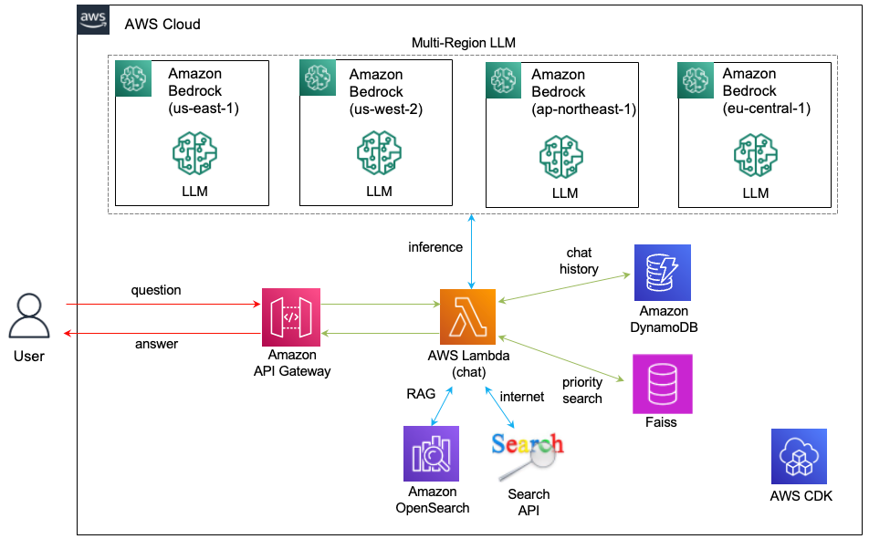
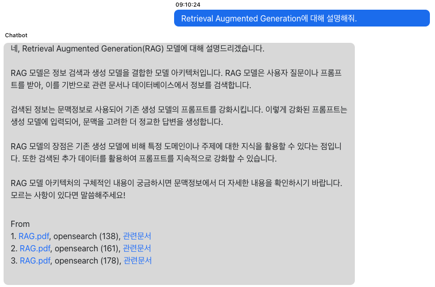

# 한영 동시 검색 및 인터넷 검색을 활용하여 RAG를 편리하게 활용하기

기업의 중요한 문서를 검색하여 편리하게 활용하기 위하여 LLM(Large Language Model)을 활용하는 기업들이 늘어나고 있습니다. 기업의 모든 데이터를 사전학습하는 것은 비용 및 시간에 대한 제약뿐 아니라 데이터 보안 면에서도 바람직하지 않습니다. [RAG(Retrieval-Augmented Generation)](https://docs.aws.amazon.com/ko_kr/sagemaker/latest/dg/jumpstart-foundation-models-customize-rag.html)의 지식 저장소(Knowledge Store)를 활용하면, 다수의 문서를 안전하게 검색하여 관련된 문서(Relevant docuents)를 추출한 후에 LLM에서 용도에 맞게 활용할 수 있습니다.

RAG의 지식 저장소(Knowledge Store)에 한국어와 영어로 된 문서들이 등록되어 있을 때에, 질문이 한국어라면 한국어 문서만 RAG에서 검색이 가능하므로, 영어 문서를 위해서 한번 더 영어로 검색하고 한국어 결과와 합하는 과정이 필요합니다. 또한, RAG의 지식 저장소에 없는 내용을 질문할 경우에, 인터넷으로 쉽게 검색하여 답할 수 있는 간단한 질문임에도 답하지 못하는 경우가 있습니다. 여기에서는 한영 동시 검색을 이용하여 한국어로 질문시에 영어 문서까지 검색하여 통합하는 방법과 인터넷 검색을 통하여 RAG에 없는 데이터를 실시간으로 조회하여 결과를 보여주는 방법을 설명합니다. 이를 통해, RAG의 검색 성능을 향상시키고 LLM을 통한 질문과 답변(Question/Answering)에 대한 사용자 편의성을 높일 수 있습니다. 

한국어와 영어로 각각 검색한 결과로 부터 한국어 결과를 얻기 위해서는 영어로 검색한 RAG 결과들을 한국어로 번역하여 한국어로 검색한 결과들과 함께 LLM에 Context로 제공하여야 합니다. 한국어/영어 번역은 Prompt를 활용하여 LLM으로 수행할 수 있으나, 영어 검색 결과를 한국어로 번역하기 위해 여러번의 LLM 번역 요청이 필요합니다. 이를 순차적(Sequencial)으로 처리하면 사용자의 질문과 답변사이의 지연 시간이 늘어나서 사용성이 나빠지므로, 여기에서는 Multi-Region LLM을 활용하여 다수의 LLM에 번역을 동시에 요청하여 지연시간을 단축합니다. 또한 RAG의 지식 저장소에 없는 질문은 인터넷 검색으로 관련된 문서를 얻어서, RAG와 통합하여 결과를 보여줄 수 있습니다.

## Architecture 개요

한국어와 영어로 된 문서들을 RAG로 검색할 때에 한국어를 사용하는 사용자에게는 아래 2가지 방법으로 사용성을 향상 시킬 수 있습니다.  

1) 영어로 질문시, 한국어로 번역한 결과를 같이 보여줘서 이해를 돕습니다.

2) 한국어로 질문시, 한국어뿐 아니라 영어로도 검색하여 얻어진 문서들을 하나로 통합하여 보여줍니다.
   
본 게시글에서는 한국어 질문(Question)을 영어로 번역하고, 영어로 된 관련 문서들(Relevant Documents)을 한국어로 번역합니다. 또한, 관련된 문서들을 LLM의 Context Window 크기에 맞게 관련도가 높은 순서대로 배치합니다. 아래의 Architecture는 RAG를 이용하여 한국어와 영어로 된 문서들을 조회하고 이를 번역하는데, 질문/답변 사이의 지연시간을 최대한 줄일 수 있도록, Multi-Region LLM 구조를 적용하였습니다. 이를 통해, 한국어 질문시에 한국어와 영어 문서를 모두 참조한 결과를 사용자에게 제공할 수 있습니다.  

RAG는 지식 저장소에서 추출한 관련된 문서들(Relevant documents)로 Context를 생성하고 이를 기반으로 질문에 대한 답변을 생성합니다. 따라서, Context에 없는 내용을 질문하게 되면 모른다고 답변하여야 합니다. 이는 매우 정상적인 RAG 동작이지만, 인터넷으로 쉽게 검색되는 내용을 모른다고 하는것은 어플리케이션에 따라서 사용성이 좋지 않을 수 있습니다. 이와 같이 본 게시글에서는 RAG에 관련된 문서가 없는 경우에 인터넷 검색을 통해 얻은 내용을 마치 RAG처럼 활용합니다. 

아래는 한영 동시 검색 및 인터넷 검색을 활용할 수 있는 Architecture를 보여주고 있습니다. 



사용자의 요청은 [Amazon API Gateway](https://docs.aws.amazon.com/apigateway/latest/developerguide/welcome.html)를 통해 [AWS Lambda](https://docs.aws.amazon.com/lambda/)에 전달됩니다. 한영 동시 검색을 위해 다수의 문서를 번역하여야 하므로 지연시간을 단축시키기 위하여 Multi-Region LLM을 활용합니다. 여기서는 us-east-1, us-west-2, ap-northeast-1, us-central-1의 Bedrock LLM을 활용합니다. RAG의 지식 저장소로는 [Amazon OpenSearch](https://aws.amazon.com/ko/opensearch-service/features/)를 활용합니다. OpenSearch는 매우 빠르고 좋은 성능의 검색 능력을 제공할 수 있습니다. 사용자와 Chatbot의 대화이력은 [Amazon DynamoDB](https://docs.aws.amazon.com/amazondynamodb/latest/developerguide/Introduction.html)에 저장되고, 원할한 대화를 위해 활용됩니다. 또한, 여러개의 관련된 문서가 있으면, 문서의 우선 순위를 정하여 관련도가 높은 문서를 선택할 수 있어야 합니다. [Faiss의 Similarity Search](https://github.com/facebookresearch/faiss)를 활용하여 Reranking 하도록 우선성 검색(Priority Search)을 하면 소수의 문서에 대한 Embedding이 필요하지만 점수(score)를 이용해 정량적으로 문서의 관련성을 표현할 수 있습니다. 또한 Faiss는 Lambda의 process와 memory를 활용하므로 별도로 비용이 추가되지 않습니다. 

이때의 상세한 Signal Flow는 아래와 같습니다.

1. 사용자의 질문(question)은 API Gateway를 통해 Lambda에 Web Socket 방식으로 전달됩니다. Lambda는 JSON body에서 질문을 읽어옵니다. 이때 사용자의 이전 대화이력이 필요하므로 [Amazon DynamoDB](https://docs.aws.amazon.com/amazondynamodb/latest/developerguide/Introduction.html)에서 읽어옵니다. DynamoDB에서 대화이력을 로딩하는 작업은 처음 1회만 수행합니다.
2. 사용자의 대화이력을 반영하여 사용자와 Chatbot이 interactive한 대화를 할 수 있도록, 대화이력과 사용자의 질문으로 새로운 질문(Revised Question)을 생성하여야 합니다. LLM에 대화이력(chat history)를 Context로 제공하고 적절한 Prompt를 이용하면 새로운 질문을 생성할 수 있습니다.
3. 새로운 질문(Revised question)으로 OpenSearch에 질문을 하여 관련된 문서(Relevant Documents)를 얻습니다. 
4. 질문이 한국어인 경우에 영어 문서도 검색할 수 있도록 새로운 질문(Revised question)을 영어로 번역합니다.
5. 번역된 새로운 질문(translated revised question)을 이용하여 다시 OpenSearch에 질문합니다.
6. 번역된 질문으로 얻은 관련된 문서가 영어 문서일 경우에, LLM을 통해 번역을 수행합니다. 관련된 문서가 여러개이므로 Multi-Region의 LLM들을 활용하여 지연시간을 최소화 합니다.
7. 한국어 질문으로 얻은 N개의 관련된 문서와, 영어로 된 N개의 관련된 문서의 합은 최대 2xN개입니다. 이 문서를 가지고 Context Window 크기에 맞도록 문서를 선택합니다. 이때 관련도가 높은 문서가 Context의 상단에 가도록 배치합니다.
8. 관련도가 일정 이하인 문서는 버리므로, 한개의 RAG의 문서도 선택되지 않을 수 있습니다. 이때에는 Google Seach API를 통해 인터넷 검색을 수행하고, 이때 얻어진 문서들을 Priority Search를 하여 관련도가 일정 이상의 결과를 RAG에서 활용합니다. 
9. 선택된 관련된 문서들(Selected relevant documents)로 Context를 생성한 후에 새로운 질문(Revised question)과 함께 LLM에 전달하여 사용자의 질문에 대한 답변을 생성합니다.
    


## 한영 동시 검색

새로운 질문(revised question)을 영어로 변환한 후에, 번역된 새로운 질문(translated_revised_question)을 이용하여 RAG의 지식저장소의 관련된 문서(Relevant Documents)을 조회합니다. 이후, 영어로된 관련된 문서(Relevant Document)가 있으면, 한국어로 변역한 후에 한국어 검색으로 얻어진 결과(relevant_docs)에 추가합니다. 상세한 내용은 [lambda(chat)](./lambda-chat-ws/lambda_function.py)를 참조합니다.

```python
translated_revised_question = traslation_to_english(llm=llm, msg=revised_question)

relevant_docs_using_translated_question = retrieve_from_vectorstore(query=translated_revised_question, top_k=4, rag_type=rag_type)
            
docs_translation_required = []
if len(relevant_docs_using_translated_question)>=1:
    for i, doc in enumerate(relevant_docs_using_translated_question):
        if isKorean(doc)==False:
            docs_translation_required.append(doc)
        else:
            relevant_docs.append(doc)
                                   
    translated_docs = translate_relevant_documents_using_parallel_processing(docs_translation_required)
    for i, doc in enumerate(translated_docs):
        relevant_docs.append(doc)

def traslation_to_english(llm, msg):
    PROMPT = """\n\nHuman: 다음의 <article>를 English로 번역하세요. 머리말은 건너뛰고 본론으로 바로 들어가주세요. 또한 결과는 <result> tag를 붙여주세요.

    <article>
    {input}
    </article>
                        
    Assistant:"""

    try: 
        translated_msg = llm(PROMPT.format(input=msg))
    except Exception:
        err_msg = traceback.format_exc()
        print('error message: ', err_msg)        
        raise Exception ("Not able to translate the message")
    
    return translated_msg[translated_msg.find('<result>')+9:len(translated_msg)-10]
```

영어로된 관련문서를 번역할때의 지연시간을 줄이기 위해 아래와 같이 multi thread를 이용합니다. 아래에서는 4개의 Multi-Region Profile을 활용하여 4개의 LLM으로 RAG 문서를 한국어로 번역합니다. 이를 위해, 영어로 관련문서 리스트를 추출하고, 각 리전의 LLM에 병렬로 번역을 요청합니다.

```python
def translate_relevant_documents_using_parallel_processing(docs):
    selected_LLM = 0
    relevant_docs = []    
    processes = []
    parent_connections = []
    for doc in docs:
        parent_conn, child_conn = Pipe()
        parent_connections.append(parent_conn)
            
        llm = get_llm(profile_of_LLMs, selected_LLM)
        process = Process(target=translate_process_from_relevent_doc, args=(child_conn, llm, doc))            
        processes.append(process)

        selected_LLM = selected_LLM + 1
        if selected_LLM == len(profile_of_LLMs):
            selected_LLM = 0

    for process in processes:
        process.start()
            
    for parent_conn in parent_connections:
        doc = parent_conn.recv()
        relevant_docs.append(doc)    

    for process in processes:
        process.join()
    
    return relevant_docs

def translate_process_from_relevent_doc(conn, llm, doc):
    translated_excerpt = traslation_to_korean(llm=llm, msg=doc['metadata']['excerpt'])

    doc['metadata']['translated_excerpt'] = translated_excerpt

    conn.send(doc)
    conn.close()
```

관련된 문장의 숫자가 늘어났으므로 context로 활용할 문서를 추출합니다. 아래의 priority_search()는 Faiss의 유사성 검색(similarity search)를 이용하여 관련문서를 reranking하는 동작을 수행합니다. 

```python
selected_relevant_docs = []
if len(relevant_docs)>=1:
    selected_relevant_docs = priority_search(revised_question, relevant_docs, bedrock_embeddings)

def priority_search(query, relevant_docs, bedrock_embeddings):
    excerpts = []
    for i, doc in enumerate(relevant_docs):
        if doc['metadata']['translated_excerpt']:
            content = doc['metadata']['translated_excerpt']
        else:
            content = doc['metadata']['excerpt']
        
        excerpts.append(
            Document(
                page_content=content,
                metadata={
                    'name': doc['metadata']['title'],
                    'order':i,
                }
            )
        )  

    embeddings = bedrock_embeddings
    vectorstore_confidence = FAISS.from_documents(
        excerpts,  # documents
        embeddings  # embeddings
    )            
    rel_documents = vectorstore_confidence.similarity_search_with_score(
        query=query,
        k=top_k
    )

    docs = []
    for i, document in enumerate(rel_documents):

        order = document[0].metadata['order']
        name = document[0].metadata['name']
        assessed_score = document[1]

        relevant_docs[order]['assessed_score'] = int(assessed_score)

        if assessed_score < 200:
            docs.append(relevant_docs[order])    

    return docs
```            

선택된 관련 문서(selected_relevant_docs)를 이용해 Prompt를 생성한 후에 LLM에 질의하여 영한 검색을 통한 결과를 얻을 수 있습니다. 관련된 문서에 번역된 발췌문(translated_excerpt)이 있으면 Context에 포함하여 Prompt를 구성합니다. 결과는 아래처럼 Stream으로 사용자에게 보여줍니다.

```python
relevant_context = ""
for document in selected_relevant_docs:
    if document['metadata']['translated_excerpt']:
        content = document['metadata']['translated_excerpt']
    else:
    content = document['metadata']['excerpt']

relevant_context = relevant_context + content + "\n\n"
print('relevant_context: ', relevant_context)

stream = llm(PROMPT.format(context = relevant_context, question = revised_question))
msg = readStreamMsg(connectionId, requestId, stream)

def readStreamMsg(connectionId, requestId, stream):
    msg = ""
    if stream:
        for event in stream:
            msg = msg + event

            result = {
                'request_id': requestId,
                'msg': msg,
                'status': 'proceeding'
            }
            sendMessage(connectionId, result)
    return msg         
```


### Google Search API를 이용한 검색기능

Multi-RAG로 검색하여 Relevant Document가 없는 경우에 Google API를 이용해 검색한 결과를 RAG에서 사용합니다. Google Search API를 사용하기 위해서는 아래와 같이 클라이언트를 설치하여야 합니다. 

```text
pip install google-api-python-client
```

Google Search API를 사용하기 위해서는 [api_key](https://developers.google.com/custom-search/docs/paid_element?hl=ko#api_key)와 [검색엔진 ID](https://programmablesearchengine.google.com/controlpanel/create?hl=ko)가 필요합니다. 이 키들을 안전하게 활용하기 위하여 [cdk-rag-enhanced-searching-stack.ts](./cdk-rag-enhanced-searching/lib/cdk-rag-enhanced-searching-stack.ts)와 같이 [AWS Secret Manager](https://docs.aws.amazon.com/secretsmanager/latest/userguide/intro.html)를 이용합니다. 

```typescript
const googleApiSecret = new secretsmanager.Secret(this, `google-api-secret-for-${projectName}`, {
    description: 'secret for google api key',
    removalPolicy: cdk.RemovalPolicy.DESTROY,
    secretName: 'googl_api_key',
    generateSecretString: {
        secretStringTemplate: JSON.stringify({
            google_cse_id: 'cse_id'
        }),
        generateStringKey: 'google_api_key',
        excludeCharacters: '/@"',
    },

});
googleApiSecret.grantRead(roleLambdaWebsocket) 
```

Google Search API는 [googleapiclient.discovery](https://googleapis.github.io/google-api-python-client/docs/epy/googleapiclient.discovery-module.html)로 새로운 질문(revised question)을 전달하고 아래와 같이 결과를 추출합니다. 이때, assessed_score는 priority search시 FAISS의 Score로 업데이트 됩니다. 상세한 내용은 [lambda(chat)](./lambda-chat-ws/lambda_function.py)을 참조합니다.


```python
from googleapiclient.discovery import build

google_api_key = os.environ.get('google_api_key')
google_cse_id = os.environ.get('google_cse_id')

api_key = google_api_key
cse_id = google_cse_id

relevant_docs = []
try:
    service = build("customsearch", "v1", developerKey = api_key)
    result = service.cse().list(q = revised_question, cx = cse_id).execute()
    print('google search result: ', result)

    if "items" in result:
        for item in result['items']:
            api_type = "google api"
            excerpt = item['snippet']
            uri = item['link']
            title = item['title']
            confidence = ""
            assessed_score = ""

            doc_info = {
                "rag_type": 'search',
                "api_type": api_type,
                "confidence": confidence,
                "metadata": {
                    "source": uri,
                    "title": title,
                    "excerpt": excerpt,                                
                },
                "assessed_score": assessed_score,
            }
        relevant_docs.append(doc_info)
```


### 영어로 질문시 한글 결과를 같이 보여주기

[lambda(chat)](./lambda-chat-ws/lambda_function.py)와 같이 결과가 한국어/영어인 것을 확인하여, 한국어가 아니라면 LLM을 통해 영어로 번역을 수행합니다. 결과는 영어와 함께 한국어 번역을 보여줍니다.

```python
if isKorean(msg)==False:
  translated_msg = traslation_to_korean(llm, msg)

msg = msg+'\n[한국어]\n'+translated_msg

def isKorean(text):
    pattern_hangul = re.compile('[\u3131-\u3163\uac00-\ud7a3]+')
    word_kor = pattern_hangul.search(str(text))

    if word_kor and word_kor != 'None':
        return True
    else:
        return False

def traslation_to_korean(llm, msg):
    PROMPT = """\n\nHuman: Here is an article, contained in <article> tags. Translate the article to Korean. Put it in <result> tags.
            
    <article>
    {input}
    </article>
                        
    Assistant:"""

    try: 
        translated_msg = llm(PROMPT.format(input=msg))
    except Exception:
        err_msg = traceback.format_exc()
        print('error message: ', err_msg)        
        raise Exception ("Not able to translate the message")
    
    msg = translated_msg[translated_msg.find('<result>')+9:len(translated_msg)-10]
    
    return msg.replace("\n"," ")
```

### AWS CDK로 인프라 구현하기

[CDK 구현 코드](./cdk-multi-rag-chatbot/README.md)에서는 Typescript로 인프라를 정의하는 방법에 대해 상세히 설명하고 있습니다.

## 직접 실습 해보기

### 사전 준비 사항

이 솔루션을 사용하기 위해서는 사전에 아래와 같은 준비가 되어야 합니다.

- [AWS Account 생성](https://repost.aws/ko/knowledge-center/create-and-activate-aws-account)


### CDK를 이용한 인프라 설치
[인프라 설치](./deployment.md)에 따라 CDK로 인프라 설치를 진행합니다. 


### 실행결과

"Retrieval Augmented Generation에 대해 설명해줘."로 입력하면, RAG에 문서가 없으므로 인터넷 검색을 통해 얻어온 결과를 보여줍니다. 대용량 언어 모델(LLM)의 특성 및 구글 검색 결과의 차이에 의해 실습의 답변은 아래 화면과 조금 다를 수 있습니다. 


[RAG.pdf](./contents/RAG.pdf) 파일을 다운로드한 후에 채팅화면 하단의 파일 아이콘을 선택하여 업로드 합니다. "Retrieval Augmented Generation에 대해 설명해줘."을 다시 입력하면, 영어로 된 RAG의 문서를 참조하여 한국어로 답변하였음을 알 수 있습니다.




## 리소스 정리하기 

더이상 인프라를 사용하지 않는 경우에 아래처럼 모든 리소스를 삭제할 수 있습니다. 

1) [API Gateway Console](https://ap-northeast-1.console.aws.amazon.com/apigateway/main/apis?region=ap-northeast-1)로 접속하여 "api-chatbot-for-rag-enhanced-searching", "api-rag-enhanced-searching"을 삭제합니다.

2) [Cloud9 console](https://ap-northeast-1.console.aws.amazon.com/cloud9control/home?region=ap-northeast-1#/)에 접속하여 아래의 명령어로 전체 삭제를 합니다.


```text
cd ~/environment/rag-enhanced-searching/cdk-rag-enhanced-searching/ && cdk destroy --all
```


## 결론

기업의 데이터를 쉽게 검색하고 편리하게 활용할 수 있도록 한국어/영어 문서들에 대한 한국어 RAG 검색 방법에 대해 설명하였습니다. 한국어/영어 문서를 통합 검색하기 위하여 한국어/영어로 RAG 검색을 수행하고 얻어진 결과를 LLM으로 번역하여 한국어 결과가 나오도록 통합하였습니다. 이때  Multi-Region LLM을 활용하여 질문과 답변사이의 지연시간을 최소화 하였습니다. RAG로 관련된 문서들이 검색되지 않은 경우에는 인터넷 검색을 활용하여 사용성을 향상시켰습니다. 이와 같이 RAG의 검색 기능을 강화하고 한영 문서를 한번에 검색할 수 있도록 RAG의 사용성을 개선할 수 있습니다. RAG는 기업의 데이터를 안전하고 편리하게 활용할 수 있는 유용한 기술입니다. Foundation Model 기반의 LLM은 기존 Chatbot이 제공하지 못하는 자연스러운 대화를 제공하고, RAG를 통해 기업의 중요한 데이터를 편리하고 안전하게 사용할 수 있도록 해줍니다. 


## 실습 코드 및 도움이 되는 참조 블로그

아래의 링크에서 실습 소스 파일 및 기계 학습(ML)과 관련된 자료를 확인하실 수 있습니다.

- [Amazon SageMaker JumpStart를 이용하여 Falcon Foundation Model기반의 Chatbot 만들기](https://aws.amazon.com/ko/blogs/tech/chatbot-based-on-falcon-fm/)
- [Amazon SageMaker JumpStart와 Vector Store를 이용하여 Llama 2로 Chatbot 만들기](https://aws.amazon.com/ko/blogs/tech/sagemaker-jumpstart-vector-store-llama2-chatbot/)
- [VARCO LLM과 Amazon OpenSearch를 이용하여 한국어 Chatbot 만들기](https://aws.amazon.com/ko/blogs/tech/korean-chatbot-using-varco-llm-and-opensearch/)
- [Amazon Bedrock을 이용하여 Stream 방식의 한국어 Chatbot 구현하기](https://aws.amazon.com/ko/blogs/tech/stream-chatbot-for-amazon-bedrock/)


